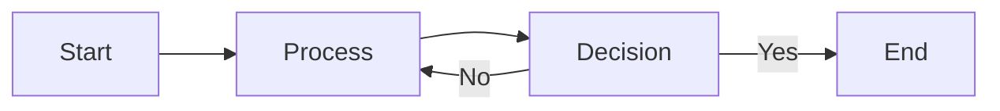
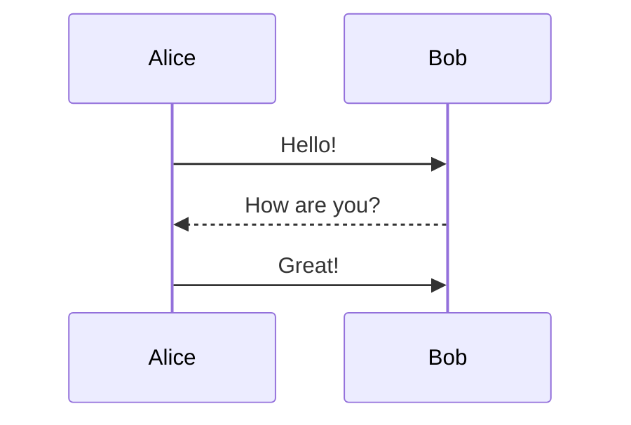
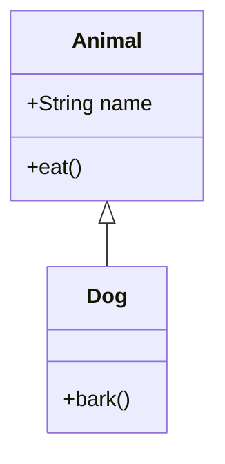
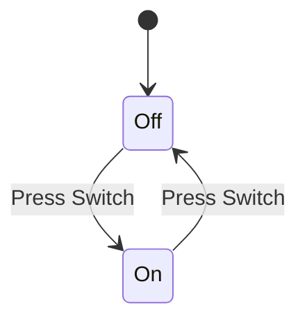
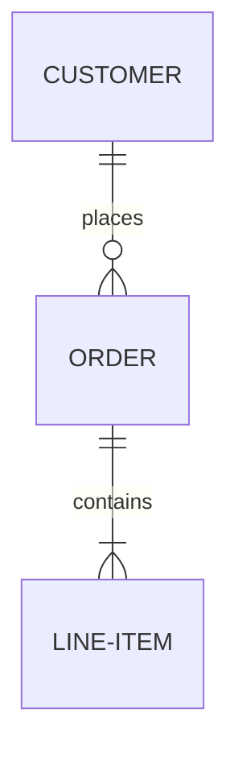
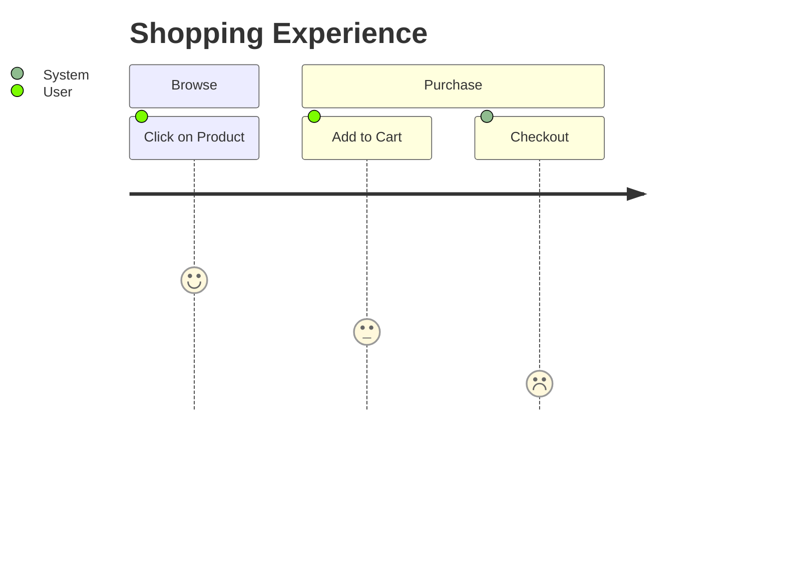
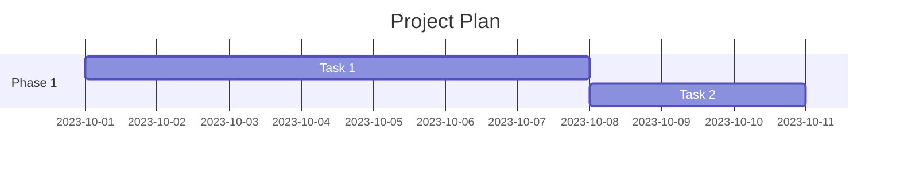
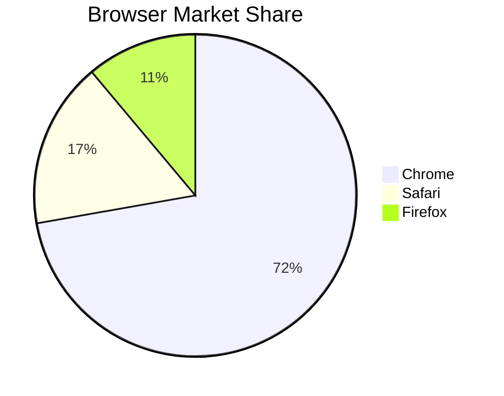
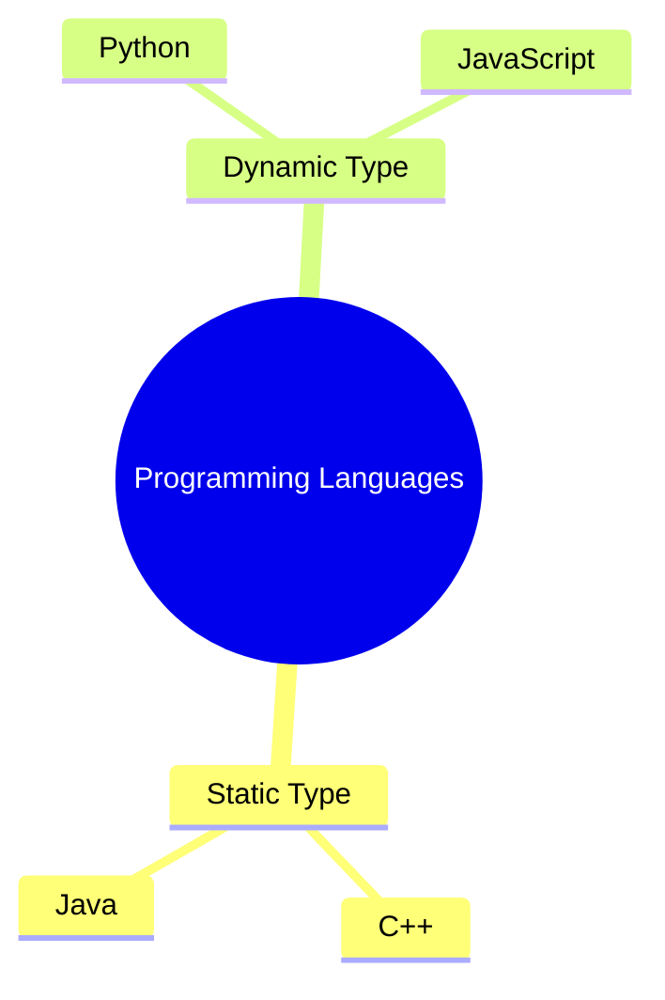
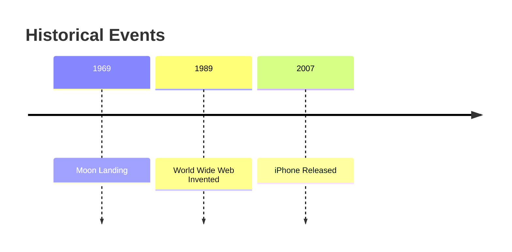

# Flowchart

```mermaid
flowchart LR
  Start --> Process --> Decision -->|Yes| End
  Decision -->|No| Process
```

# Sequence Diagram

```mermaid
sequenceDiagram
  Alice->>Bob: Hello!
  Bob-->>Alice: How are you?
  Alice->>Bob: Great!
```

# Class Diagram

```mermaid
classDiagram
  class Animal {
    +String name
    +eat()
  }
  class Dog {
    +bark()
  }
  Animal <|-- Dog
```

# State Diagram

```mermaid
stateDiagram-v2
  [*] --> Off
  Off --> On : Press Switch
  On --> Off : Press Switch
```

# Entity Relationship Diagram

```mermaid
erDiagram
  CUSTOMER ||--o{ ORDER : places
  ORDER ||--|{ LINE-ITEM : contains
```

# User Journey Map

```mermaid
journey
  title Shopping Experience
  section Browse
    Click on Product: 5: User
  section Purchase
    Add to Cart: 3: User
    Checkout: 1: System
```

# Gantt Chart

```mermaid
gantt
  title Project Plan
  section Phase 1
    Task 1 :a1, 2023-10-01, 7d
    Task 2 :after a1, 3d
```

# Pie Chart

```mermaid
pie
  title Browser Market Share
  "Chrome" : 65
  "Safari" : 15
  "Firefox" : 10
```

# Mindmap

```mermaid
mindmap
  root((Programming Languages))
    Static Type
      Java
      C++
    Dynamic Type
      Python
      JavaScript
```

# Timeline

```mermaid
timeline
  title Historical Events
  1969 : Moon Landing
  1989 : World Wide Web Invented
  2007 : iPhone Released
```

