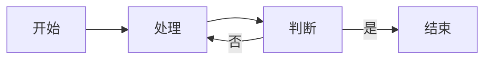
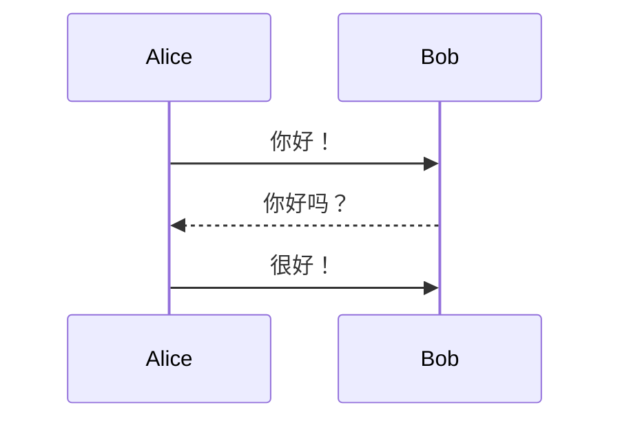
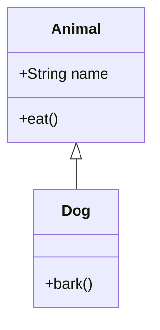
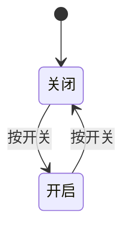
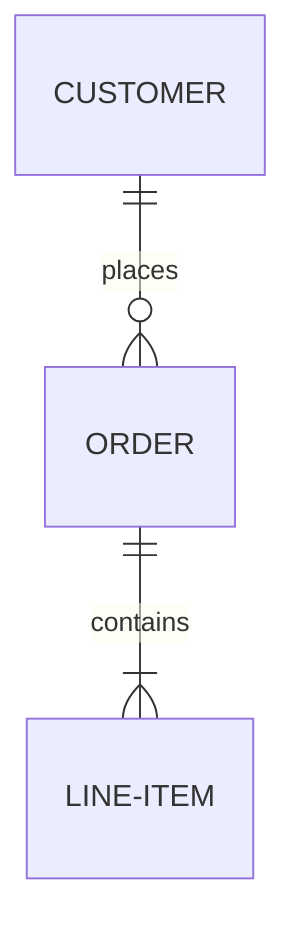
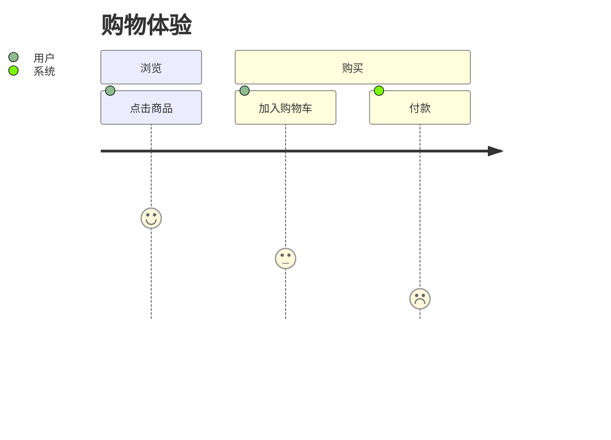
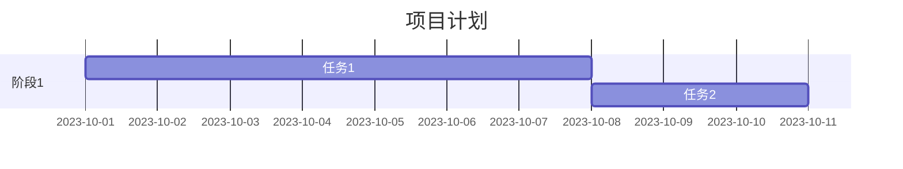
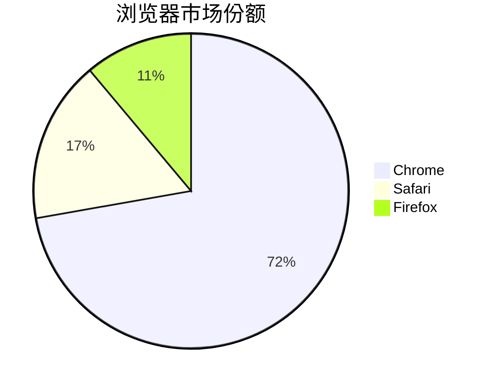
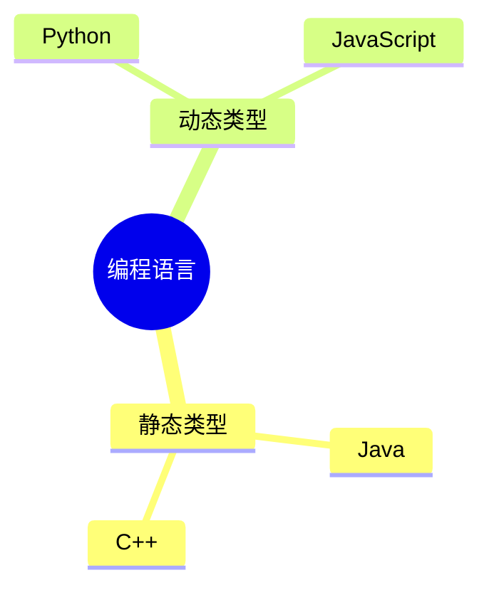
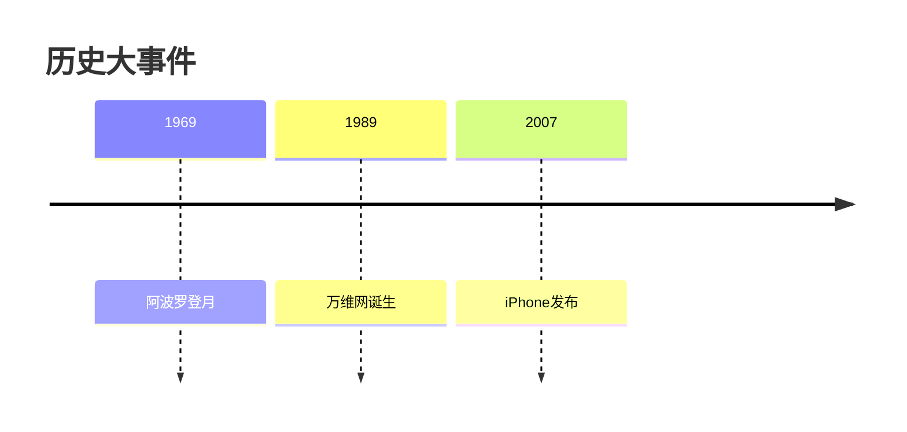

# 流程图

```mermaid
flowchart LR
  开始 --> 处理 --> 判断 -->|是| 结束
  判断 -->|否| 处理
```

# 时序图

```mermaid
sequenceDiagram
  Alice->>Bob: 你好！
  Bob-->>Alice: 你好吗？
  Alice->>Bob: 很好！
```

# 类图

```mermaid
classDiagram
  class Animal {
    +String name
    +eat()
  }
  class Dog {
    +bark()
  }
  Animal <|-- Dog
```

# 状态图

```mermaid
stateDiagram-v2
  [*] --> 关闭
  关闭 --> 开启 : 按开关
  开启 --> 关闭 : 按开关
```

# 实体关系图

```mermaid
erDiagram
  CUSTOMER ||--o{ ORDER : places
  ORDER ||--|{ LINE-ITEM : contains
```

# 用户旅程图

```mermaid
journey
  title 购物体验
  section 浏览
    点击商品: 5: 用户
  section 购买
    加入购物车: 3: 用户
    付款: 1: 系统
```

# 甘特图

```mermaid
gantt
  title 项目计划
  section 阶段1
    任务1 :a1, 2023-10-01, 7d
    任务2 :after a1, 3d
```

# 饼图

```mermaid
pie
  title 浏览器市场份额
  "Chrome" : 65
  "Safari" : 15
  "Firefox" : 10
```

# 思维导图

```mermaid
mindmap
  root((编程语言))
    静态类型
      Java
      C++
    动态类型
      Python
      JavaScript
```

# 时间线

```mermaid
timeline
  title 历史大事件
  1969 : 阿波罗登月
  1989 : 万维网诞生
  2007 : iPhone发布
```
